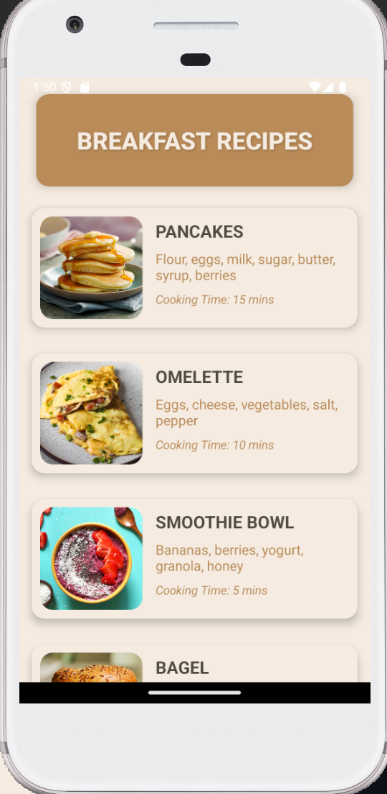
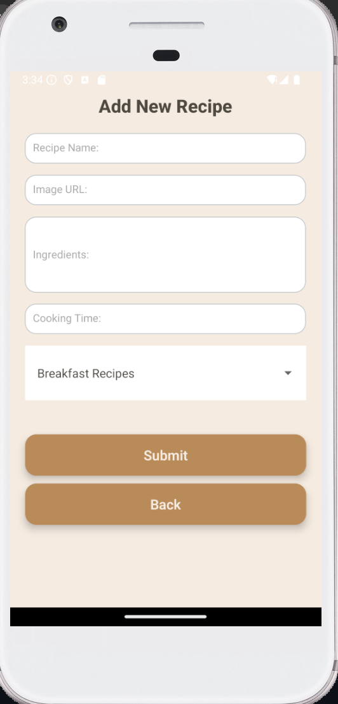
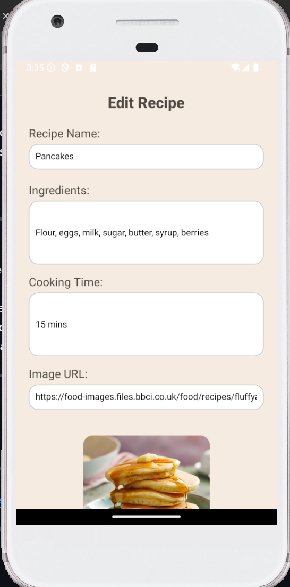
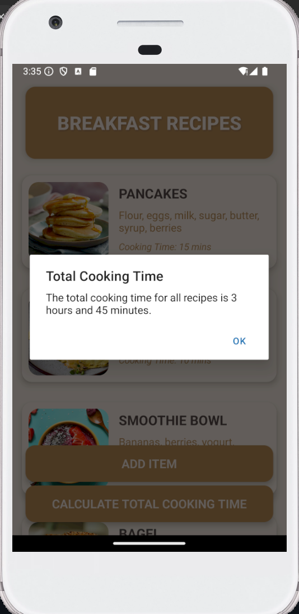

App Name: Recipe Manager 
-----------

🍴 Recipe Manager is a React Native app designed for cooking enthusiasts to manage and organize recipes effortlessly. With a clean and intuitive interface, this app allows users to add, edit, and view recipes, as well as calculate the total cooking time for all recipes. It's a perfect companion for anyone who loves cooking and wants to stay organized in the kitchen!

-----------
 
📱 Features:  
View Recipes: Browse through a categorized list of recipes with details such as name, ingredients, and cooking time. 
Add Recipes: Add new recipes with details like name, ingredients, and cooking time. 
Edit Recipes: Modify existing recipes and save updates instantly. 
Calculate Total Cooking Time: Calculate the combined cooking time for all recipes, displayed in hours and minutes. 
Interactive UI: User-friendly design with a seamless navigation experience. 
 
  
-----------
 
Screenshots of the app:
 
 
 
 
 

-----------
 
Video walkthrough of the app:
[https://www.youtube.com/watch?v=0Yn-NjlbfLg]
 
 
------------
